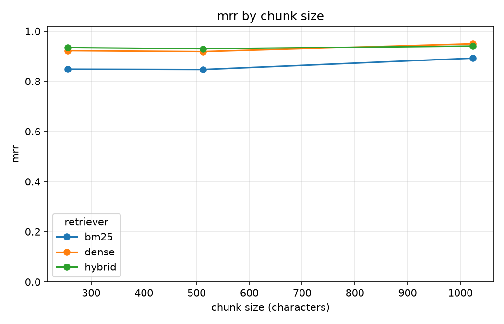

# ragsweep

**Stop guessing your chunk size.** Point it at your documents and a set of labelled
questions, and it tells you which retrieval settings actually find the right passage.

[](https://github.com/mohsinaliwork686-rgb/ragsweep/actions/workflows/ci.yml)
[](https://www.python.org/downloads/)
[](LICENSE)

---

## The problem

Every RAG system makes four choices before it retrieves anything: chunk size, overlap,
embedding model, and whether to match on vectors, keywords, or both.

Almost nobody measures them. `chunk_size=512, overlap=50` gets copied from a tutorial and
never revisited. Then retrieval is mediocre, and the blame lands on the generation model,
the prompt, or "hallucination" — when the real problem is that the correct passage never
reached the context window at all.

**If the right passage is not retrieved, no amount of prompt engineering fixes the
answer.** Retrieval is the ceiling on everything downstream, and it is the part nobody
checks.

## What it does

```console
$ ragsweep run

17 documents, 31 questions, 54 runs

retriever  strategy  chunk  ovl   r@1   r@3   r@5  r@10   MRR  time
dense      fixed       256    0  0.87  0.92  0.97  0.98  0.95  0.0s  *
hybrid     sentence    256    0  0.84  0.95  0.98  1.00  0.95  0.0s
dense      recursive  1024   64  0.87  0.92  0.98  1.00  0.95  0.0s
dense      sentence   1024    0  0.87  0.92  0.98  1.00  0.95  0.0s
hybrid     fixed      1024    0  0.84  0.94  0.97  1.00  0.94  0.0s
bm25       fixed      1024   64  0.77  0.92  0.95  1.00  0.89  0.0s
bm25       recursive   512    0  0.68  0.95  0.97  1.00  0.85  0.0s
bm25       fixed       256    0  0.68  0.92  0.94  1.00  0.84  0.0s

Best: dense / fixed / chunk 256 / overlap 0

Written to results.json
```

An answer, measured, instead of a guess. `r@k` is recall at k — the share of relevant
documents that made it into the top k.

## What the example run actually found

These numbers come from the handbook corpus in [`examples/`](examples/), using
`all-MiniLM-L6-v2`. The aggregate gap between keyword search and embeddings looks modest:
MRR 0.89 against 0.95. Broken down by question type, it is not modest at all — it is
concentrated almost entirely in one place.

| question type | bm25 | dense | hybrid |
|---------------|-----:|------:|-------:|
| plain lookup | 0.95 | 1.00 | 1.00 |
| two documents compete | 1.00 | 1.00 | 1.00 |
| the answer is "no, you can't" | 0.85 | 0.87 | 0.83 |
| needs two documents | 0.90 | 0.87 | 0.90 |
| **wording does not match the document** | **0.53** | **0.84** | **0.90** |

On four of the five categories, keyword search is level with embeddings or ahead of them,
and it is roughly a hundred times faster. The entire case for embeddings on this corpus is
the last row: questions like *"How do I get my money back?"* where the document says
*refund* and never says *money back*.

That is the kind of thing an aggregate score hides and a per-category breakdown does not.
It is also the kind of thing that is worth knowing before paying for an embedding model.



## Why there is a keyword baseline

`bm25` is classic keyword ranking. No model, no embeddings, no download — it is implemented
in this repo in about sixty lines. It is in the sweep on purpose, because a tool that only
measured embeddings would hide results like the table above and quietly push people toward
the slower, more expensive option.

## Install

```bash
pip install ragsweep                 # bm25, numpy and rich. Nothing heavy
pip install "ragsweep[dense]"        # adds sentence-transformers for real embeddings
pip install "ragsweep[chart]"        # adds matplotlib for the PNG
```

The base install works immediately and needs no model download.

> **On Python 3.14:** the `dense` extra will not install, because PyTorch has no 3.14
> wheels yet. The rest of `ragsweep` is fine on 3.14 — only the embedding model is
> affected. Use 3.11 to 3.13 if you need dense retrieval.

## Use

```bash
ragsweep init                   # write a starter sweep.toml, labels.jsonl and corpus/
ragsweep run                    # run the sweep described by sweep.toml
ragsweep run --no-cache         # re-embed everything
ragsweep report results.json    # re-print a saved sweep
ragsweep report results.json --format csv
ragsweep report results.json --chart chart.png
```

Exit code is `1` on a bad corpus or results file and `2` on a bad config, so it drops into
a script without a wrapper.

## Configure

`sweep.toml`:

```toml
corpus = "./corpus"
labels = "./labels.jsonl"

retrievers  = ["bm25", "dense", "hybrid"]
strategies  = ["fixed", "sentence", "recursive"]
chunk_sizes = [256, 512, 1024]
overlaps    = [0, 64]
models      = ["sentence-transformers/all-MiniLM-L6-v2"]
k           = [1, 3, 5, 10]

cache = ".cache/ragsweep"
```

Every combination of those lists is measured. Combinations where overlap is at least the
chunk size are skipped rather than failing the run.

## The labels file

Relevance is recorded per **document**, never per chunk. Chunk ids change every time the
chunk size changes, so chunk-level labels would have to be rewritten for every
configuration in the sweep, which defeats the whole point.

```jsonl
{"id": "q01", "question": "How many days of paid holiday do staff get?", "relevant": ["annual-leave.md"], "tags": ["simple"]}
{"id": "q22", "question": "Who approves a nine hundred dollar refund?", "relevant": ["refunds.md", "approvals.md"], "tags": ["multi-hop"]}
```

Thirty-one hand-written questions is enough to be useful. Tags are free-form and are what make
the per-category breakdown above possible.

If a label points at a document the corpus does not contain, `ragsweep run` says so before
starting. A typo there silently caps every score in the sweep and looks exactly like bad
retrieval.

## Why it is fast

A naive implementation re-chunks and re-embeds for every combination. The work is shared in
layers instead, because each layer only depends on the ones above it:

```
strategy + size + overlap  ->  chunk once
  + model                  ->  embed once (cached to disk)
    + retriever            ->  build the index once
      + k                  ->  free: retrieve max(k) once, slice for each k
```

BM25 does not depend on the embedding model, so it runs once per chunking however many
models are swept.

The 54-run example above takes **1m 41s** cold and **1.3s** on a repeat, because the
embedding cache survives between runs. That ratio is the difference between a tool you
re-run while tuning and one you run once and abandon.

## The results file

`results.json` carries per-case detail, not just the aggregates, so a later run can be
diffed against it question by question. Averages are exactly what hides a regression.

```json
{
  "schema": 1,
  "tool": "ragsweep",
  "corpus": { "documents": 17, "fingerprint": "..." },
  "runs": [
    {
      "id": "dense-fixed-256-0-all-MiniLM-L6-v2",
      "config": { "retriever": "dense", "strategy": "fixed", "chunk_size": 256, "overlap": 0 },
      "metrics": { "recall@1": 0.87, "recall@5": 0.97, "mrr": 0.95 },
      "cases": [
        { "id": "q11", "expected": ["refunds.md"], "first_correct_rank": 1, "score": 1.0 }
      ]
    }
  ]
}
```

The schema is versioned from the first release. Reading a file written by a newer version
fails with a message saying so, rather than a missing-field error three layers down.

## About the example corpus

[`examples/handbook/`](examples/handbook/) is a **synthetic** company handbook written for
this repository. It exists so the numbers above are reproducible, not as a general
benchmark — a benchmark tuned by the person reporting the results is worth nothing.

It is built to contain the cases that break naive retrieval: near-duplicate documents that
compete (refunds vs returns, shipping vs international shipping), questions needing two
documents, questions whose answer is that something is *not* allowed, and questions whose
wording shares no vocabulary with the document that answers them.

**Point `corpus` at your own documents.** That is the only run whose answer means anything
for your system.

## Non-goals

- **It does not measure answer quality.** Retrieval only. No generation, no LLM-as-judge.
- **It needs no paid API.** Everything runs locally and free.
- **It is not a RAG framework.** It answers one offline question: which settings should I use?

## Development

The design decisions and their reasoning are in
[docs/IMPLEMENTATION_PLAN.md](docs/IMPLEMENTATION_PLAN.md).

```bash
make install    # venv + dev extras
make check      # ruff + pytest, what CI runs
make demo       # sweep the example handbook
```

## License

MIT — see [LICENSE](LICENSE).
